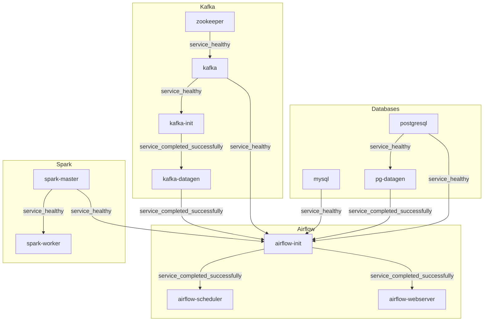

# Итоговое домашнее задание по дисциплине "Python для инженерии данных"

Проект представляет собой ***полностью автоматизированную*** систему обработки данных, разворачиваемую одной командой. Конфигурация проекта облегчена для запуска на локальной машине.

### Стек
- **Airflow**: Оркестрация.
- **Spark**: Обработка данных.
- **PostgreSQL** и **MySQL**: Реляционные базы данных.
- **Kafka** и **Zookeeper**: Системы обмена сообщениями.
- **Python**: Генераторы данных в PG и Kafka.
- **Docker**: Контейнеризация сервисов.

### Важно
- Проект рекомендуется запускать на устройстве с RAM>=16GB. Из-за большого количества сервисов без предварительных ограничений Docker может занять практически всю свободную оперативную память, сильно замедляя локаль вплоть до необходимости перезапуска.
- Время сборки проекта: 10-20 минут в зависимости от доступных ресурсов и пропускной способности сети.
- Время развертывания проекта: 5-10 минут в зависимости от доступных ресурсов.

## Автоматизация

Система состоит из 12 контейнеров:
1. PostgreSQL
2. MySQL
3. Spark Master
4. Spark Worker
5. Генератор данных для PostgreSQL (pg_datagen)
6. Генератор данных для Kafka (kafka_datagen)
7. Kafka Init
8. Kafka
9. Zookeeper
10. Airflow Init
11. Airflow Scheduler
12. Airflow Webserver

Все контейнеры основаны на открытых Docker Image. Они автоматически настраиваются и проверяют свою готовность с использованием Healthcheck. Система обеспечена скриптами для автоматической генерации данных, их репликации, стриминга и создания аналитических витрин.

### Идемпотентность

- Создание баз данных, пользователей, таблиц и выдача прав реализованы как идемпотентные операции, что гарантирует корректное повторное выполнение без дублирования.
- Генерация данных в PostgreSQL также идемпотентна: каждый запуск проверяет наличие ранее созданных данных и не выполняет повторную генерацию в случае их наличия.
- Все подключения и конфигурации в Airflow создаются автоматически при инициализации контейнера `airflow-init`, включая соединения, пользователи и базовые настройки.

### Dependency Graph сборки

Каждая нода графа - отдельный контейнер.



## Сервисы и их конфигурация

### Управление конфигурацией
Вся конфигурация проекта управляется через единый файл `.env`, который содержит параметры для всех сервисов, включая логины, пароли, порты и настройки генерации данных.

### Доступы к данным и UI сервисов

### PostgreSQL
- **URL**: `jdbc:postgresql://localhost:5432/postgres_finals_db?currentSchema=postgres_finals_schema`
- **Логин**: `finals_user`
- **Пароль**: `finals_pass`

### MySQL
- **URL**: `jdbc:mysql://localhost:3306/mysql_finals_db`
- **Логин**: `finals_user`
- **Пароль**: `finals_pass`

### Airflow Web UI
- **URL**: `http://localhost:8080`
- **Логин**: `admin`
- **Пароль**: `admin`

### Spark Master
- **URL**: `http://localhost:8081`

### Kafka
- **Bootstrap Servers**: `localhost:9092`
- **Топик**: `new_users_events`

### Генерация данных

**Параметры генерации для PostgreSQL по умолчанию:**
  - Количество пользователей: 5000
  - Количество товаров: 500
  - Количество заказов: 10000
  - Детали заказов: 40000
  - Категории товаров: 5000

**Параметры генерации для Kafka по умолчанию:**
  - Интервал генерации событий: 3 секунды
  - Топик Kafka: `new_users_events`
  - События генерируются в формате JSON с полями: `first_name`, `last_name`, `email`, `phone`, `registration_date`, `loyalty_status`.

## Репликация данных
В Airflow реализована репликация данных из PostgreSQL в MySQL. DAG выполняет следующие задачи:
1. Извлечение данных из PostgreSQL.
2. Трансформация данных через Spark.
3. Сохранение данных в MySQL.

## Стриминг данных
В Airflow реализована обработка данных из Kafka. DAG выполняет следующие задачи:
1. Получение данных из темы Kafka.
2. Обработка данных с использованием Spark.
3. Сохранение данных в PostgreSQL.

## Аналитические витрины

### Витрина активности пользователей (mart_user_activity)

#### Описание
Витрина для последующего анализа поведения пользователей - количества заказов и общей суммы затрат, разбитых по статусам заказов.

#### Поля и их описание

| Поле           | Описание                      |
|----------------|-------------------------------|
| user_id        | Идентификатор пользователя    |
| first_name     | Имя пользователя              |
| last_name      | Фамилия пользователя          |
| status         | Статус заказа                 |
| order_count    | Количество заказов            |
| total_spent    | Общая сумма затрат            |

### Витрина продаж продуктов (mart_product_sales)

#### Описание
Витрина для последующего анализа продаж товаров с учетом количества проданных единиц и общей выручки, разбитых по статусам заказов. Может быть использована, например, для исследования популярности товаров, их влияния на общий доход, эффективности категорий товаров и их соответствия ожиданиям клиентов.

#### Поля и их описание
| Поле                   | Описание                          |
|------------------------|-----------------------------------|
| product_id             | Идентификатор товара              |
| name                   | Название товара                   |
| status                 | Статус заказа                     |
| total_quantity_sold    | Общее количество проданных единиц |
| total_sales            | Общая выручка                     |

### Витрина средних чеков (mart_average_check)

#### Описание
Витрина для последующего анализа средних чеков с разбивкой по статусу заказа и статусу лояльности. Может быть использована, например, для оценки эффективностм маркетинговых стратегий и программ лояльности, или для настройки акций и предложений для разных групп клиентов.

#### Поля и их описание
| Поле               | Описание                               |
|--------------------|----------------------------------------|
| status             | Статус заказа                          |
| loyalty_status     | Статус лояльности пользователя         |
| average_check      | Средний чек для группы заказов  |

### Скрипты для витрин

Для создания витрин используется Spark. Скрипты загружают данные из MySQL, выполняют агрегации и сохраняют результаты обратно в базу данных. Шаги:
1. Загрузка исходных данных из базы данных MySQL.
2. Выполнение трансформаций (объединения, группировки, агрегации, etc.)
3. Сохранение результирующих витрин в базу данных MySQL.

## Сборка, деплой и запуск DAG

1. Склонировать проект:
    ```
    git clone git@github.com:avshapoval/python_de_finals.git
    ```
2. Перейти в корневую директорию проекта:
    ```
    cd python_de_finals
    ```
3. Запустить команду:
    ```
    docker-compose up --build [-d]
    ```
4. После сборки проекта и его развертывания будут доступны интерфейсы PostgreSQL, MySQL, Airflow, Kafka и Spark по указанным выше URL.
5. Все что остается сделать вручную после окончания деплоя - включить (переевсти в `unpaused`) DAG в UI Airflow. Т.к. используется всего один executor (`SequentialExecutor`), включать необходимо в следующей последовательности:
    1. replicate_from_pg_to_mysql
    2. create_analytical_marts
    3. stream_from_kafka_to_pg

## Структура проекта
Проект организован следующим образом:
```plaintext
python_de_finals/
├── .env                # Переменные окружения для настройки всех сервисов
├── docker-compose.yml  # Конфигурация Docker Compose
├── infra/              # Инфраструктура контейнеров
│   ├── airflow/        # Конфигурация Airflow
│   │   ├── init/       
│   │   ├── scheduler/  
│   │   └── webserver/  
│   ├── datagen/        # Конфигурация для генераторов данных
│   │   ├── pg_datagen/
│   │   └── kafka_datagen/
│   ├── db/             # Конфигурация СУБД
│   │   ├── mysql/     
│   │   └── postgresql/
│   ├── messaging/      # Конфигурация ZK&Kafka
│   │   ├── kafka/
│   │   ├── kafka_init/
│   │   └── zookeeper/
│   └── spark/          # Конфигурация Spark
│       ├── spark-master/
│       └── spark-worker/
├── code/               # Исходный код
│   ├── airflow/        # DAG и скрипты для Airflow
│   │   ├── dags/       # DAG
│   │   └── scripts/    # Скрипты, используемые в DAG
│   │       ├── helpers/        # Вспомогательные модули
│   │       └── pyspark_scripts/ # Скрипты PySpark
│   ├── datagen/        # Генераторы данных
│   │   ├── pg_datagen/ # Скрипты для генерации данных в PG
│   │   └── kafka_datagen/ # Скрипты для генерации данных в Kafka
```